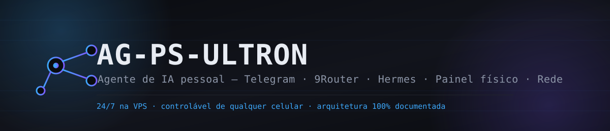

<p align="center">
  
</p>

<p align="center">
  
  
  
  
  
  
  
</p>

<p align="center">
  Agente de IA pessoal que roda <b>24/7 numa VPS</b>, acessível de qualquer
  celular via <b>Telegram</b> ou de um <b>painel físico dedicado</b> (um
  celular velho rodando a PWA "Ultron Deck"), com ferramentas próprias de
  SAP, controle de TV/rede e agenda.
</p>

---

Este repositório documenta a arquitetura completa do sistema, de ponta a
ponta: como cada peça foi construída, como instalar/configurar cada
agente do zero, e como tudo se conecta. Assim como no componente
`panel/`, hostnames, IPs, IDs de chat e tokens reais foram substituídos
por placeholders — o objetivo é documentar *como o sistema é construído*,
não expor a infraestrutura real.

## Diagrama completo

```
                                 ┌───────────────────────────┐
                                 │   Celular (qualquer um)    │
                                 │       app Telegram         │
                                 └─────────────┬─────────────┘
                                               │ mensagem
                                               ▼
 ┌───────────────────────┐    HTTP LAN    ┌───────────────────────────────────────────────┐
 │  Celular velho fixo    │◄──────────────►│                                                 │
 │  PWA "Ultron Deck"     │                │               VPS Linux (Docker)               │
 ├───────────────────────┤                │                                                 │
 │  Notebook Windows      │      SSH       │   ┌─────────────────────────────────────────┐   │
 │  panel/server.py :8090 │───────────────►│   │  Hermes Agent                           │   │
 └───────────┬───────────┘                │   │  - gateway Telegram / e-mail             │   │
             │ chama                      │   │  - CLI: status, send, model, secrets...  │   │
             ▼                            │   └───────────────────┬─────────────────────┘   │
 ┌───────────────────────┐                │                       │ modelo de IA             │
 │  WSL Kali Linux        │                │                       ▼                         │
 │  nmap + arp + avahi    │                │   ┌─────────────────────────────────────────┐   │
 │  Raptor (sec. de app)  │                │   │  9Router — gateway compat. OpenAI        │   │
 └───────────────────────┘                │   │  roteia: Gemini / Claude / GPT-OSS /     │   │
                                           │   │          OpenRouter                       │   │
                                           │   └─────────────────────────────────────────┘   │
                                           │                                                 │
                                           │   ┌───────────────────┐ ┌─────────────────────┐ │
                                           │   │  /sap             │ │  /tools             │ │
                                           │   │  lg-control.mjs   │ │  cal_daily2.py       │ │
                                           │   │  fetch-note.mjs   │ │  MS Graph / Google   │ │
                                           │   └───────────────────┘ └─────────────────────┘ │
                                           └───────────────────────────────────────────────┘
```

O painel físico e o Telegram são duas portas de entrada para o **mesmo**
agente (Hermes, na VPS) — não há dois agentes. O WSL Kali é local ao
notebook: cobre descoberta de rede (nmap/arp/avahi) e testes de segurança
de aplicação (Raptor), mas não fala com a VPS diretamente — quem faz essa
ponte é sempre o `panel/server.py`, via SSH.

## Índice

- [ARCHITECTURE.md](ARCHITECTURE.md) — arquitetura completa: como o
  Hermes, o 9Router, o Telegram, o painel físico e as ferramentas de SAP se
  encaixam.
- [panel/](panel/) — o painel de controle físico (PWA + servidor local no
  Windows). Tem sua própria [ARCHITECTURE.md](panel/ARCHITECTURE.md) e
  [SETUP.md](panel/SETUP.md) detalhados.
- [RUNBOOK.md](RUNBOOK.md) — passo a passo real de tudo que foi
  diagnosticado, corrigido e construído neste projeto, comando por
  comando, com observações.
- [INSTALL.md](INSTALL.md) — manual passo a passo para instalar e
  configurar o Hermes e o 9Router do zero, e construir o seu próprio
  Ag-PS-Ultron.
- [NETWORK.md](NETWORK.md) — configuração de rede completa: LAN de casa
  e acesso remoto via WireGuard.

## O que o sistema é capaz de fazer

**Conversar por Telegram, de qualquer celular** — o Hermes roda como um
gateway de mensageria persistente na VPS; qualquer mensagem no Telegram
chega ao agente, que responde usando um modelo de IA.

**Rodar 24/7 numa VPS, não no notebook** — o agente não depende do PC do
usuário estar ligado; é um serviço de longa duração na VPS, gerenciado por
Docker.

**Escolher o modelo de IA via um gateway próprio (9Router)** — em vez de
depender de uma única conta/API de um provedor, o agente fala com um
gateway HTTP compatível com a API da OpenAI que o próprio usuário mantém,
que por sua vez roteia para múltiplos modelos (Gemini, Claude, GPT-OSS via
"antigravity", ou outros provedores via OpenRouter).

**Controlar TVs e dispositivos de rede** — um script Node.js (`lg-control`)
liga/desliga e comanda TVs LG na rede local a partir de comandos do agente.

**Controle e segurança de rede via WSL Kali** — descoberta completa de
dispositivos na LAN sob demanda (nmap + ARP + mDNS), e um framework
próprio de testes de segurança (**Raptor**: análise estática, SCA,
fuzzing, teste de aplicação web) disponível na mesma distro para auditar
as próprias superfícies expostas. Detecção de invasão *contínua*
(alertar sozinho quando um dispositivo novo aparece) ainda é um design
proposto, não implementado — ver [ARCHITECTURE.md](ARCHITECTURE.md).

**Consultar e agir sobre notas do SAP** — um script (`fetch-note`) busca
notas técnicas do SAP, com sessão de navegador (login) já persistida, para
não precisar autenticar a cada consulta.

**Mostrar a agenda do dia** — scripts de calendário na VPS (Microsoft
Graph/WorkMail e Google Calendar) alimentam o card de reuniões do painel
físico, sem depender do Outlook estar aberto em lugar nenhum.

**Um painel físico dedicado** — um celular velho, sempre ligado na tomada,
rodando a PWA do painel (ver [panel/](panel/)) como controle físico rápido:
abrir apps, RDP, volume, scanner de rede, e um atalho de voz/texto direto
para o agente.

## Stack

- **Hermes** — framework de agente de IA (Python), com CLI própria, gateway
  de mensageria multiplataforma (Telegram, e-mail, WhatsApp, Slack...),
  gerenciamento de segredos e sessões — roda como serviço Docker na VPS.
- **9Router** — gateway HTTP próprio, compatível com a API da OpenAI, que
  o Hermes usa como "Custom endpoint" em vez de falar direto com um
  provedor de IA.
- **Ferramentas SAP** (`/sap`) — Node.js, com Playwright/Puppeteer para
  automação de navegador com sessão de login persistida.
- **Painel físico** (`panel/`) — Python (stdlib) + PWA, ver documentação
  própria.

Veja [ARCHITECTURE.md](ARCHITECTURE.md) para o diagrama completo e o fluxo
de dados entre cada peça.
