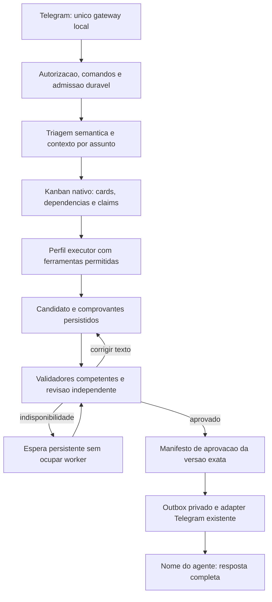

# Fila por assunto com infraestrutura nativa do Hermes

## Status e decisao

Revisao 2, em 2026-09-29. Substitui o desenho que propunha outro scheduler e
outro banco de jobs. Yuri autorizou processamento em segundo plano, entregas
completas por assunto na ordem de aprovacao, autoria real e ajustes de tom em
Jesus, Pink e Cerebro. Depois pediu eliminar tetos arbitrarios e aproveitar ao
maximo a configuracao nativa. Dois trabalhos deixam de ser um teto do produto;
capacidade simultanea depende do host, provedores e recursos compartilhados.

**Especificacao revisada, nao fila instalada.** Evidencias e testes da base
instalada estao em [Auditoria Nativa](2026-09-29-topic-queue-native-audit.md).
Nao ha nova pendencia de autorizacao do mesmo desenho geral. A ativacao depende
dos testes tecnicos abaixo, nao de pedir novamente a aprovacao ja recebida.

## Resultado esperado

Uma mensagem pode conter varios assuntos; mensagens posteriores podem continuar
um assunto ou abrir outro. B pode chegar antes de A quando nao depende dela.
Uma tarefa lenta nao absorve, cancela ou bloqueia outra independente. O usuario
recebe `Nome do agente: resposta`, com autor comprovado pela execucao, atraves
do mesmo bot e na mesma conversa Telegram.

Nao enviar confirmacoes de recebimento, rascunhos, pensamentos internos, votos
de revisores ou avisos genericos de revisao no lugar do resultado. Saudacao
junto de pedido concreto faz parte da resposta desse pedido. Esclarecimentos,
autorizacoes indispensaveis e falhas terminais reais podem exigir mensagem
objetiva com assunto e proximo passo. Pendencia temporaria continua em background.

## Escolha arquitetural

| Alternativa | Avaliacao |
|---|---|
| Apenas configuracao nativa | Nao garante triagem semantica em um chat, aprovacao obrigatoria ou entrega duravel |
| Fila, scheduler e workers proprios | Duplica Kanban, claims, dependencias e recuperacao; aumenta manutencao |
| **Kanban nativo com adaptacao de dominio** | **Escolhida:** reutiliza o motor e acrescenta somente os contratos exigidos pelo Ultron |

O diagrama representa um assunto; varios percorrem o fluxo independentemente.
Dependencias entre assuntos apontam para resultados aprovados, nunca candidatos.
Nao esperar todos os filhos de uma mensagem para entregar um assunto ja aprovado.
A tarefa pai acompanha o conjunto sem virar barreira ou reenviar seus filhos.

## Reuso e extensao

| Responsabilidade | Reuso nativo |
|---|---|
| Persistencia e historico | Kanban: tasks, links, runs, events e artifacts |
| Dependencias | DAG e promocao de tarefas prontas |
| Concorrencia | Dispatcher no gateway, teto global/por perfil e guarda de memoria |
| Exclusao e recuperacao | Claims, heartbeat, TTL, identidade de PID e reconciliacao |
| Perfis | Configuracao, SOUL, memoria, ferramentas e resolucao de modelo |
| Modelos auxiliares | Cliente auxiliar e `auxiliary.kanban_decomposer` |
| Delegacao dentro de um trabalho | `delegate_task`, quando as permissoes permitirem |
| Transporte e inspecao | Adapter Telegram, CLI, logs e dashboard existentes |

Nao criar tabelas concorrentes de jobs, dependencias, leases ou execucoes.
Nao adicionar Redis, Celery, Temporal, blockchain externa, outro bot ou outro
consumidor do token. Runtime inteiramente local em Windows/WSL Debian; nenhuma
VPS faz parte do Ultron.

`agent/topic_queue/` sera um adaptador do Kanban, nao outro motor. Suas funcoes:

1. Admissao idempotente, origem/reply, assuntos, versoes e vinculos com cards.
2. Catalogo de permissoes, recursos mutaveis e comprovantes de operacoes.
3. Validadores por dominio, correcao e manifesto verificavel de aprovacao.
4. Outbox, autoria, formatacao, receipts e tratamento de envio incerto.
5. Compatibilidade, reconciliacao e metricas privadas de funcionamento.

Uma extensao SQLite privada guarda somente os dados ausentes no Kanban:
ingressos, assuntos/versoes, vinculos, operacoes, manifestos e outbox. Estado
nativo e a autoridade sobre execucao. Nao alterar o schema upstream. Artefatos
grandes ficam em arquivos privados referenciados por hashes. Diretorio proposto:
`/root/.hermes/topic-queue/`, incluido no backup criptografado, nunca no GitHub.

Nao existe transacao atomica entre os dois bancos. Criacao usa intencao
persistida, chave de correlacao unica e reconciliacao antes de liberar o card.
Queda entre passos nao pode criar outro card executavel para o mesmo pedido.
Hooks aceleram o processamento; reconciliacao duravel repara eventos perdidos.

## Configuracao nativa e capacidade

Chaves verificadas no codigo instalado. Sao **valores-alvo condicionados a
integracao e testes**, nao arquivo para substituir a configuracao viva.

| Chave | Proposta e semantica |
|---|---|
| `display.busy_input_mode` | `queue`; nao cria assuntos por si so |
| `display.busy_text_mode` | `queue`; conserva nova mensagem sem steering |
| `display.busy_ack_enabled` | `false`, entregas completas sem aviso de recebimento |
| `max_concurrent_sessions` | `null` nao limita sessoes; nao paraleliza uma unica sessao |
| `kanban.dispatch_in_gateway` | Reutilizar dispatcher existente; sem outro daemon |
| `kanban.dispatch_interval_seconds` | Avaliar `5` segundos; padrao instalado e `60`, nao prazo de resposta |
| `kanban.max_in_progress` | `null` usa memoria e resulta em 2 a 8 nesta versao; **nao ilimitado** |
| `kanban.max_spawn` | Omitir evita teto adicional por board; quando definido e concorrencia, nao lote |
| `kanban.max_in_progress_per_profile` | `1` enquanto houver memoria mutavel compartilhada; outros perfis seguem paralelos |
| `kanban.dispatch_profiles` | Allowlist de perfis aptos; nao habilitar todos automaticamente |
| `kanban.auto_decompose` | Decomposer generico nao pode promover cards gerenciados antes da validacao do plano |
| `kanban.auto_subscribe_on_create` | Cards gerenciados nao recebem assinatura passiva de candidatos |
| `kanban.review_dispatch` | Injeta `sdlc-review`; nao e validador universal para outros dominios |
| `auxiliary.kanban_decomposer` | Modelo/timeout e rota local 9Router via cliente nativo; sem chave em codigo |
| `delegation.independent_completions` | `true`, conclusoes independentes ainda sujeitas a validacao/entrega |
| `delegation.oneshot_max_children` | `0` remove teto total por one-shot, nao a concorrencia |
| `delegation.child_timeout_seconds` | `0` desativa esse timeout; falhas/cancelamento/limites de API continuam |
| `delegation.max_concurrent_children` | Capacidade contabilizada com o pai, sem multiplicar workers x filhos livremente |
| `delegation.inherit_mcp_toolsets` | Avaliar `false` nos perfis restritos, provar paridade antes de migrar |
| `delegation.subagent_auto_approve` | Manter `false`; autonomia nao e autorizacao irrestrita |
| `tools.tool_search.enabled` | Manter `auto`, sem carregar todas as ferramentas no prompt |

Nao desligar decomposicao, review ou notificacoes globalmente para resolver um
board. Sem configuracao por board, adaptar somente cards gerenciados e preservar
os demais. Configuracoes do dispatcher sao lidas no boot; nao prometer hot reload.

**Sem teto arbitrario de assuntos nao significa processos infinitos.** Aceitar
trabalho duravel enquanto houver armazenamento; ajustar execucao pela capacidade
real. Elevar alem do padrao exige medicao de memoria, latencia e cotas. A guarda
de memoria permanece ativa. Disco cheio produz falha explicita de admissao,
nunca perda silenciosa. Backpressure adia trabalho, nao o descarta.

Nao aumentar profundidade, tokens e concorrencia ao maximo simultaneamente.
Aliases que compartilham cota nao sao provedores independentes. Triagem, execucao
e revisao precisam de admissao por recurso e backoff; o limite nativo por memoria
nao mede cotas do 9Router. Nao habilitar provedor desligado nem alterar planos.

## Triagem e continuidade

Reutilizar cliente auxiliar e catalogo de perfis, mas nao chamar
`decompose_task` como classificador sem adaptacao: aceita JSON flexivel, limita
corpo de entrada e pode promover tarefas imediatamente. Plano proposto precisa
de schema fechado, validacao e separacao do plano executavel.

- Rodar apos autorizacao, pausa, comandos e aprovacoes. `pre_gateway_dispatch`
  vem antes de auth; nao usar para gravar ingressos ou chamar modelos. Cobrir
  tambem o caminho ocupado do adapter. Persistir antes do FIFO ocupado nativo:
  ele tem teto de 32 pendencias e descarta excedentes. A fila gerenciada nao
  depende desse buffer em memoria nem de flush durante shutdown normal.
- Pedidos apontam trechos reais do texto autorizado. E-mail, citacao, transcricao
  e retorno de ferramenta sao dados, nao novas autorizacoes.
- Datas, UIDs e nomes como Easysapers nao significam nota SAP. Pergunta sobre
  localizacao de e-mails continua em e-mail; SAP exige intencao SAP.
- Cobrir a mensagem inteira; dividir/reconciliar entradas longas, sem truncamento
  silencioso pelo limite do decomposer.
- Reply conhecido associa assunto. Sem reply, usar resumos daquele dono/chat;
  esclarecer ambiguidade material em vez de operar por palpite.
- Sem ciclos, perfis inventados ou referencias entre donos/chats. Perfil escolhido
  nao ganha novas ferramentas. Contexto compartilhado so por referencia necessaria.
- FIFO por assunto; correcao de escopo incrementa versao e revoga aprovacao e
  outbox ainda nao enviados. Assuntos independentes continuam.
- Falha de triagem conserva ingresso pendente, sem escolher ferramenta aleatoria.

Topicos Telegram nativos sao opcionais, nao requisito: mudam a experiencia para
threads/lobby, enquanto o pedido e manter a mesma conversa.

## Execucao e retomada

Reutilizar cards, claims, `request_review`, `request_changes`, `schedule_task`
e `unblock_task` conforme precondicoes reais. `scheduled` nao acorda por horario
sozinho: extensao persiste `retry_at` e revalida tarefas vencidas.

Conclusao de etapa interna nao e aprovacao de resultado. Uma etapa pode passar
candidato ao validador; dependentes externos ao assunto esperam manifesto
aprovado. `done` isolado nao e aprovacao. O card final gerenciado so chega a
`done` pela transicao verificada, inclusive por CLI/dashboard/force. Hooks
pos-commit nao impoem essa barreira; requer veto antes da transicao.

Worker nativo resolve ferramentas CLI do perfil, possivelmente mais amplas que
o bridge. Provar paridade antes de trocar executor. Se configuracao nativa nao
reproduzir a allowlist, conservar worker restrito como adapter do dispatcher.
Nao substituir bridge vivo pela copia publica antiga nem dar terminal a
conselheiros. Preservar ferramentas e permissoes atuais.

Resultado inclui perfil real, session/run ID, candidato, `completed`,
`model_review`, ferramentas e comprovantes. Texto nao vazio e `failed=false`
nao bastam: `completed=false`/revisao pendente nunca vira `status=ok` ou entrega.
Autor exibido produziu a versao aprovada. Reescrita substantiva por Ultron
nao pode ser atribuida ao especialista que produziu um texto anterior.

Antes da operacao, registrar intencao/chave de efeito; depois, comprovante.
Correcao reutiliza comprovantes. Queda entre efeito e comprovante exige
reconciliacao, nao repeticao. Claim nativo nao torna idempotente uma API externa.
Mesmo recurso/perfil mutavel e serializado; terminal arbitrario e conservador.

Cancelamento invalida a geracao: worker antigo nao pode publicar nem liberar
dependentes. Reabrir predecessor aproveita invalidacao nativa de descendentes
e revoga seus manifestos/outbox obsoletos. Comprovantes de efeitos ja ocorridos
nao sao apagados. Aprovacao textual nao autoriza nova acao externa.

## Cadeia de validadores

"Blockchain" aqui e cadeia de aprovadores competentes, nao moeda ou rede
distribuida. Fluxo: contrato/evidencia -> especialista -> revisao independente
exigida pela politica -> verificacao deterministica antes de enviar.

| Tema | Competencia a selecionar no catalogo local |
|---|---|
| Saude e rotina | Jesus; Botura/Arnold quando nutricao/treino forem pertinentes |
| Financas e negocios | Bigode; Buffett para investimentos, sem mudar permissoes |
| SAP | Thor com evidencias de ferramentas SAP autorizadas |
| E-mail | Cris corporativo/Greg pessoal; Mr. Robot para suspeita de fraude |
| Memoria e contexto | Pink para curadoria; Cerebro para conflitos/estrategia |
| Codigo e arquitetura | Hercules/Perseu/Mr. Robot/Iron Man conforme a mudanca |
| Conteudo e campanhas | Money; revisao adicional para gasto/risco legal |

Catalogo e politica existente determinam participantes adicionais; a tabela nao
dispensa Tanos, Frank ou outro controle aplicavel. Nao inventar perfil ausente.
Personas diferentes no mesmo modelo/provedor nao comprovam independencia.
Registrar identidade servida, cadeia exigida e pareceres sem fabricar consenso.

Manifesto vincula pedido/versao, autor/run, hash do texto final, hashes de
anexos/evidencias, validadores e versao da politica. Alteracao material exige
nova revisao. Hash detecta mudanca, nao prova veracidade nem imutabilidade local.

Retirar teto fixo de uma ou duas correcoes como regra geral. Usar orcamento
configuravel por ciclo, progresso verificavel e deteccao de candidato/criticas
repetidos. Falha de provedor usa backoff e libera worker. Correcao textual usa
comprovantes congelados, sem ferramentas operacionais. Persistir consumo
acumulado; requeue nao zera contadores para esconder loop. Falta de progresso
estaciona para reconciliacao/decisao, sem aprovar por cansaco ou chamadas infinitas.

Confirmacao descreve somente o registro salvo. Nao acrescentar doses, horarios
ou orientacao clinica nao pedidos. Revisor recebe evidencias do assunto atual,
nao buscas antigas de outro tema. Ingestao fisica de medicamento nao e validada
pelo banco, e o agente nao substitui orientacao profissional.

## Entrega completa

Reusar adapter, nao notificacao passiva como outbox. Notifier pode emitir
`review_requested` e avanca cursor antes de enviar. `delivery_mode=wake` evita
ping passivo, mas nao garante aprovacao, autoria ou recuperacao de envio.

Conclusoes async de delegacao reentram como novos turnos; o caminho nativo
tambem sugere status de uma linha ao despachar. `busy_ack_enabled=false` nao
silencia isso. Turno de mero despacho nao produz resposta visivel. Completion
wakes e candidatos passam pela revisao/outbox, sem envio pela saida normal do
gateway. Nao suprimir mensagens de autorizacao ou esclarecimento necessarias.

Persistir intencao unica com corpo/anexos, destino e hashes antes do envio.
Nao regenerar texto com outro modelo depois da aprovacao. Confirmar somente
com receipt/message ID; capturar cada parte de mensagem longa. Timeout apos
possivel envio vira `delivery_uncertain`, sem reenvio cego. Telegram nao oferece
chave arbitraria de exatamente-uma-vez.

Um emissor por conversa preserva ordem das partes sem intercalar assuntos.
Entregas elegiveis seguem aprovacao; backoff proprio de um item nao retem os
independentes. Transporte indisponivel afeta todos. Somente IDs efetivamente
enviados alimentam reply -> assunto. Pausa global impede execucao e entrega;
cancelar um assunto nao cancela os demais.

Prefixo do autor, paragrafos curtos, listas uteis, links preservados, escape
Telegram e anexos aprovados. Sem JSON/pareceres internos despejados na conversa.
Nenhum worker recebe token ou envia diretamente. Autorizacao vale para a
conversa de origem, nao para e-mails, publicacoes ou mensagens a terceiros.

## Personalidades autorizadas

- **Jesus:** sereno, acolhedor e franco, sem sermao ou sarcasmo diante de
  sofrimento; conserva limites clinicos e privacidade.
- **Pink:** amigavel, leve e precisa; distingue o que sabe, salvou e falta,
  sem afirmar escrita sem comprovante ou esconder erro com simpatia.
- **Cerebro:** direto, curioso e investigativo; explica causas sem palestra,
  linguagem pomposa ou paralisia de analise.

PT-BR natural, tratamento por voce, sem cerimonia, emojis ou bajulacao. Humor
contextual e opcional. Campos de conselho ficam no contrato interno, nao em
toda conversa. Documentos externos preservam tom adequado. Alterar so blocos
pertinentes desses tres SOULs, com backup e testes de preservacao. Ultron,
outros perfis e contexto pessoal intactos; SOULs privados nao vao ao GitHub.

## Implantacao e aceite

1. Corrigir contrato do worker com regressao para conclusao/revisao pendente.
2. Adaptar Kanban em ambiente temporario: admissao, correlacao, contexto e
   versoes, sem segundo scheduler nem duplicacao de cards.
3. Integrar barreiras. Hooks para observacao; patches minimos/versionados onde
   falta veto efetivo. Nenhum bypass por CLI, dashboard ou edicao de manifesto.
4. Integrar outbox/adapter com injecao de falhas, sem mensagem a terceiros.
5. Backup privado, instalacao desativada, medicao e ativacao no escopo autorizado
   apos suite end-to-end. Nao alterar Tron/Trader Firme, tokens ou provedores.

Aceite obrigatorio:

- A lento/B rapido: B aprovado chega primeiro, sem misturar ou perder A.
- Multiplos pedidos: cobertura completa; nada truncado silenciosamente.
- Dependente espera aprovacao, inclusive quando predecessor e reaberto.
- Reply/correcao atingem tema certo; versao obsoleta nao e enviada.
- Mensagem ocupada/reinicio preservam trabalho; pausa/cancelamento funcionam.
- Rajada de 33+ mensagens e queda abrupta preservam ingressos ja admitidos,
  sem depender de flush; nenhum status intermediario de delegacao e publicado.
- Varias correcoes: acao uma vez, texto revalidado a cada versao.
- Falha de provedor/cota libera capacidade sem perder pedido ou inventar aprovacao.
- Repeticao sem progresso estaciona de forma diagnosticavel, sem retry infinito.
- Crash antes/depois de efeito, aprovacao e envio: nenhum sucesso sem comprovante.
- Nao autorizado, anexo malicioso, perfil falso e destino trocado sao recusados.
- `completed=false`, bypass manual e manifesto adulterado nao liberam entrega.
- Mesmo recurso/perfil nao sofre corrida; paralelo nao multiplica cotas.
- Disco cheio/fila extensa deixam estado explicito e recuperavel.
- Ferramentas efetivas dos workers equivalem as permissoes atuais.
- Envio longo mantem partes e autoria, sem duplicacao silenciosa.
- Tres personalidades menos formais sem mudar regras, outros perfis ou Ultron.

Desativacao bloqueia admissoes gerenciadas, drena/paralisa workers e preserva
cards, comprovantes e outbox. Rollback nao reenvia aprovados automaticamente.
Patches recusam ancoras desconhecidas; atualizacao do Hermes exige repetir
testes. Os testes de integracao acima ainda nao foram executados; a auditoria
registra exatamente o subconjunto nativo ja verificado.
